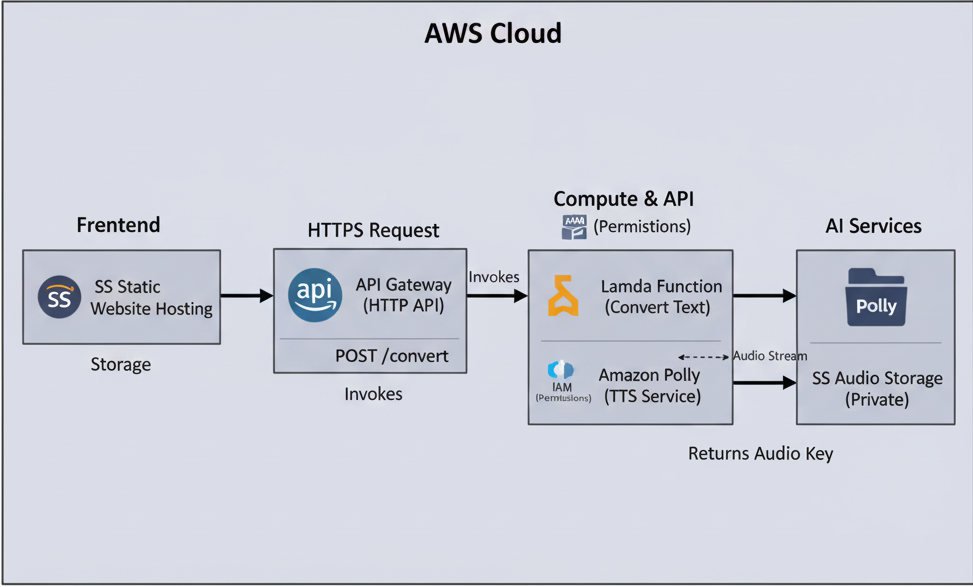
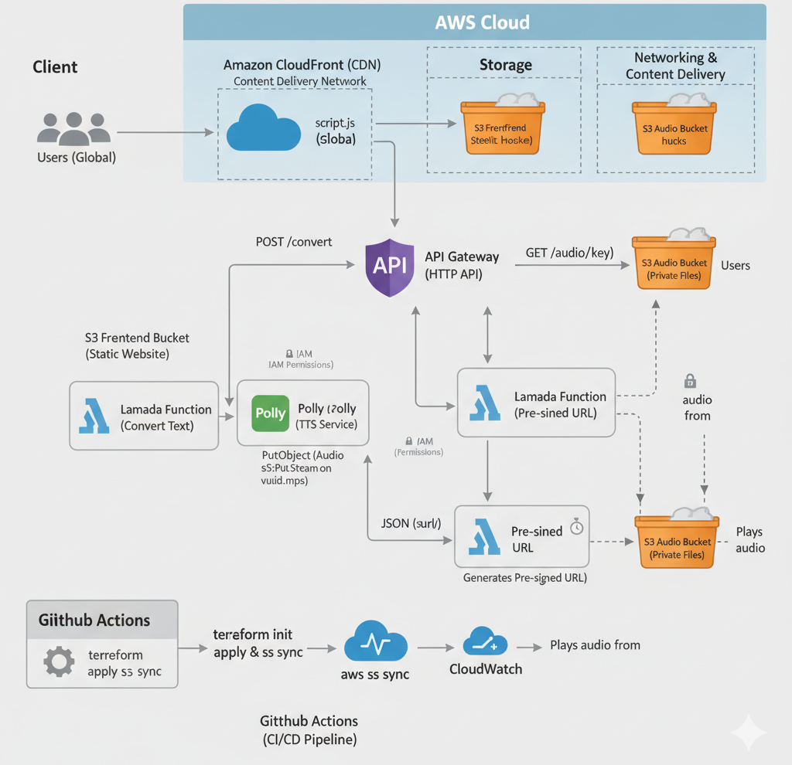

# Voiceify - Serverless Text-to-Speech Application

Transform your text into natural-sounding speech using AWS cloud services. Voiceify is a modern, serverless web application that demonstrates cloud-native architecture and full-stack development principles.

## 🚀 Features

- **Multiple Voice Options**: Choose from various AWS Polly voices (male/female, different accents)
- **Real-time Processing**: Fast text-to-speech conversion with immediate playback
- **Download Capability**: Save generated audio files for offline use
- **Responsive Design**: Works seamlessly across desktop and mobile devices
- **Serverless Architecture**: Scalable, cost-effective cloud infrastructure
- **Global CDN**: Optional CloudFront integration for worldwide performance

## 🏗️ Architecture

### Basic Architecture


### Enhanced with CloudFront CDN



```

- **Frontend**: Static website hosted on S3 with optional CloudFront CDN
- **API Gateway**: RESTful API endpoint
- **Lambda**: Serverless compute for processing
- **Polly**: AI-powered text-to-speech synthesis
- **S3**: Audio file storage with pre-signed URLs
- **CloudFront**: Global content delivery network (optional)

## 🛠️ Technologies Used

- **Infrastructure**: Terraform (Infrastructure as Code)
- **Backend**: AWS Lambda (Python), Amazon Polly, S3, API Gateway
- **Frontend**: HTML5, CSS3, JavaScript (Vanilla)
- **CDN**: Amazon CloudFront (optional)
- **Security**: IAM roles and policies, CORS configuration

## 📋 Prerequisites

- AWS Account with programmatic access
- Terraform installed
- AWS CLI configured
- Basic knowledge of AWS services

## 🚀 Quick Start

### 1. Clone Repository
```bash
git clone https://github.com/Almighty-yawnn/my-ttsApp.git
cd terraform
```

### 2. Deploy Infrastructure
```bash
cd terraform
terraform init
terraform plan
terraform apply
```

### 3. Configure Frontend
Update `frontend/config.js` with your API Gateway endpoint:
```javascript
const API_URL = "your-api-gateway-endpoint";
```

### 4. Deploy Frontend
```bash
aws s3 sync frontend/ s3://your-frontend-bucket/
```

### 5. Setup CloudFront (Optional)
For global performance enhancement:
1. Create CloudFront distribution in AWS Console
2. Set S3 bucket as origin with OAC
3. Configure caching and error pages
4. Update S3 bucket policy for CloudFront access

### 6. Access Application
Navigate to your S3 website endpoint or CloudFront domain and start converting text to speech!

## 📁 Project Structure

```
voiceify/
├── frontend/
│   ├── index.html          # Main web interface
│   ├── style.css           # Styling and animations
│   ├── script.js           # Frontend logic
│   ├── config.js           # API configuration
│   └── assets/             # Icons and images
├── lambda/
│   └── lambda_function.py  # Backend processing logic
├── terraform/
│   ├── main.tf             # Core infrastructure
│   ├── frontend.tf         # API Gateway and S3 setup
│   ├── variables.tf        # Configuration variables
│   ├── outputs.tf          # Infrastructure outputs
│   └── provider.tf         # AWS provider configuration
└── docs/
    ├── DEPLOYMENT_GUIDE.md # Detailed deployment steps
    ├── ARCHITECTURE.md     # System architecture
    └── PROJECT_DOCUMENTATION.md
```

## 🔧 Configuration

### Environment Variables
- `BUCKET_NAME`: S3 bucket for audio storage (set automatically by Terraform)

### Terraform Variables
Create `terraform.tfvars`:
```hcl
access_key = "your-aws-access-key"
secret_key = "your-aws-secret-key"
aws-region = "us-east-1"
s3-bucket-name = "your-unique-bucket-name"
frontend_bucket_name = "your-unique-frontend-bucket"
```

## 🎯 Usage

1. **Enter Text**: Type or paste text in the input area
2. **Select Voice**: Choose from available Polly voices
3. **Generate**: Click "Generate Audio" button
4. **Listen**: Audio plays automatically when ready
5. **Download**: Save audio file for offline use

## 💰 Cost Estimation

Approximate monthly costs for moderate usage (1000 requests):
- Lambda: $1-2
- API Gateway: $3-4
- Polly: $4-16 (depending on text length)
- S3: $1-2
- CloudFront: $1-3 (optional)
- **Total**: $9-27/month

## 🔒 Security Features

- IAM roles with least-privilege access
- CORS configuration for secure cross-origin requests
- Pre-signed URLs for temporary audio access (15-minute expiration)
- Input validation and sanitization
- No hardcoded credentials
- CloudFront OAC for secure S3 access

## 🌍 Performance Enhancements

### CloudFront CDN Benefits
- **Global Edge Locations**: 400+ locations worldwide
- **Faster Loading**: Static assets cached at edge locations
- **HTTPS**: Automatic SSL/TLS certificates
- **Compression**: Gzip compression for faster transfers
- **DDoS Protection**: Built-in security features

## 🚀 Future Enhancements

- [ ] User authentication and accounts
- [ ] SSML support for advanced speech control
- [ ] Batch text processing
- [ ] Usage analytics dashboard
- [ ] Mobile applications
- [x] CloudFront CDN integration
- [ ] Custom domain with Route 53

## 🤝 Contributing

1. Fork the repository
2. Create feature branch (`git checkout -b feature/amazing-feature`)
3. Commit changes (`git commit -m 'Add amazing feature'`)
4. Push to branch (`git push origin feature/amazing-feature`)
5. Open Pull Request

## 📝 License

This project is licensed under the MIT License - see the [LICENSE](LICENSE) file for details.

## 👨💻 Author

**Herbert William Mantey** (**Almightyyawn**) - *Initial work*

## 🙏 Acknowledgments

- [AWS Documentation and tutorials](https://aws.amazon.com/documentation-overview/)
- [Terraform community resources](https://developer.hashicorp.com/terraform/tutorials)
- [Open source contributors](https://youtu.be/5L2ohcTAvj8?si=X09B0M5gFnXTM90p)

---

**Made with ❤️ and ☁️ AWS Services**